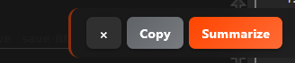
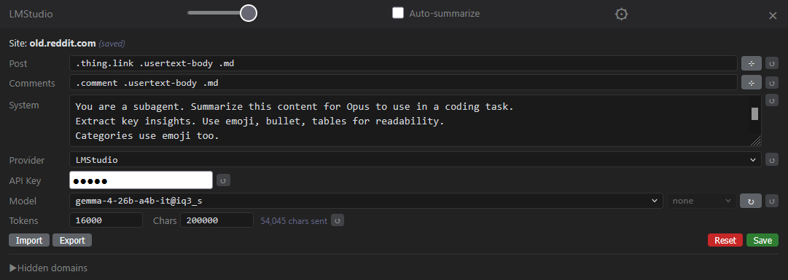
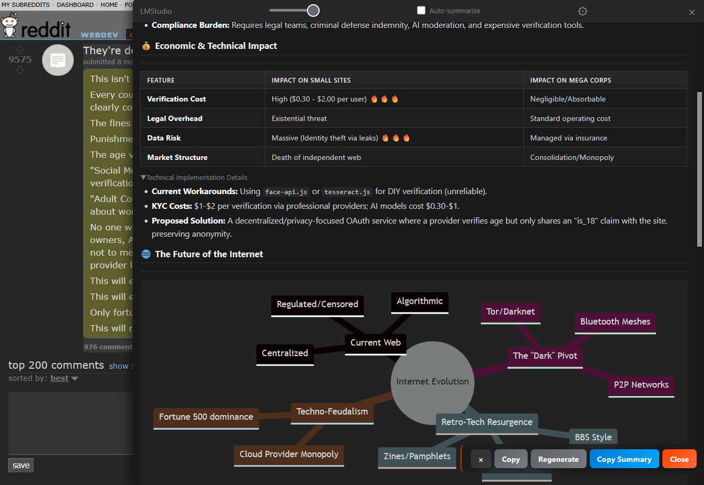

# user-scripts

A collection of userscripts for [Violentmonkey](https://violentmonkey.github.io/) / [Tampermonkey](https://www.tampermonkey.net/).

## Scripts

### AI Page Summarizer

> [`ai-summarizer/`](ai-summarizer/) — shared source, compiles to userscript + browser extension. See [`ai-summarizer/README.md`](ai-summarizer/README.md) for architecture, settings reference, and full details.

Too many tabs open. Too many words. Brain already checked out halfway through the first paragraph. This thing reads the page so you don't have to — fires it at a local LLM and streams back the good parts: bullet points, diagrams, vibes. One click, zero effort, full comprehension. Your attention span called, it wants a refund.

Works on anything: Reddit threads, HN flamewars, Stack Overflow novels, Discourse epics, random blogs, documentation you were never going to read anyway. Extracts the post, grabs the comments, sends it all to your local LLM, and you get a summary with mermaid diagrams, sentiment bars, tables, and emoji. It's like SparkNotes but for the entire internet and it runs on your own hardware.

#### How it works

**Step 1.** A toolbar lives on every page. Hover to expand it.



**Step 2.** Click `Summarize`. First time? Hit the gear icon, pick your provider (LM Studio, llama.cpp, any OpenAI-compatible endpoint), select a model, save.



**Step 3.** Watch the summary stream in. Mermaid diagrams, sentiment bars, tables, the works. Hit `Regenerate` if you want a different take. `Copy Summary` to paste it somewhere useful.



#### Features

- streaming markdown with live rendering as tokens arrive
- mermaid diagrams: mindmaps, flowcharts, sequence diagrams, pie charts, timelines
- sentiment bars: visual scoring like `[bar:8/10 Quality]`
- thinking/reasoning block display
- auto-detect content on any site, or configure CSS selectors per domain
- built-in configs for Reddit, HN, Lobsters, Lemmy, Tildes, Stack Overflow, Discourse
- visual element picker: click elements to build selectors, arrow keys for depth
- auto-summarize per domain (set it and forget it)
- per-domain hide, import/export settings, token usage display
- resizable panel with opacity slider
- copy raw extracted text or rendered summary

#### Install as userscript

1. Install [Violentmonkey](https://violentmonkey.github.io/) or Tampermonkey
2. Click [`ai-summarizer.user.js`](ai-summarizer/ai-summarizer.user.js) — extension prompts install
3. Run a local OpenAI-compatible server (default: llama.cpp at `http://localhost:8080/v1`)
4. Click `Summarize` on any page

#### Build from source

```sh
cd ai-summarizer && npm install
npm run build              # both userscript + chrome extension
npm run build:userscript   # userscript only
npm run build:extension    # chrome extension only
node build.js --firefox    # firefox extension
```

#### Load extension (dev)

- Chrome: `chrome://extensions/` → enable `Developer mode` → `Load unpacked` → select `dist/extension/`
- Firefox: `about:debugging#/runtime/this-firefox` → `Load Temporary Add-on` → pick any file in `dist/extension/`

Temporary extensions lose settings on restart. Userscript recommended for daily use.

---

### Outlook Junk Auto-Delete

> [`outlook-junk-autodelete.user.js`](outlook-junk-autodelete.user.js)

Automatically deletes junk emails from known spam senders in [Outlook Web](https://outlook.live.com/mail/).

**How it works**

- Polls the Junk Email folder via OWA's internal `service.svc` API
- Matches sender names against a configurable blocklist
- Soft-deletes matched messages (moves to Deleted Items)
- Polls every 60s when the tab is focused, every 5 minutes when backgrounded
- Authenticates using the MSAL token already in `localStorage` and the `X-OWA-CANARY` CSRF cookie — no credentials to configure

**Setup**

1. Install the script in Violentmonkey/Tampermonkey
2. Log into Outlook Web at `outlook.live.com`
3. Edit the `SENDERS` array in the script to match your spam

## Installation

1. Install [Violentmonkey](https://violentmonkey.github.io/) (recommended) or Tampermonkey in your browser
2. Click on a `.user.js` file in this repo — the extension will prompt you to install it
3. Or open the raw file URL directly

## License

[MIT](LICENSE)
