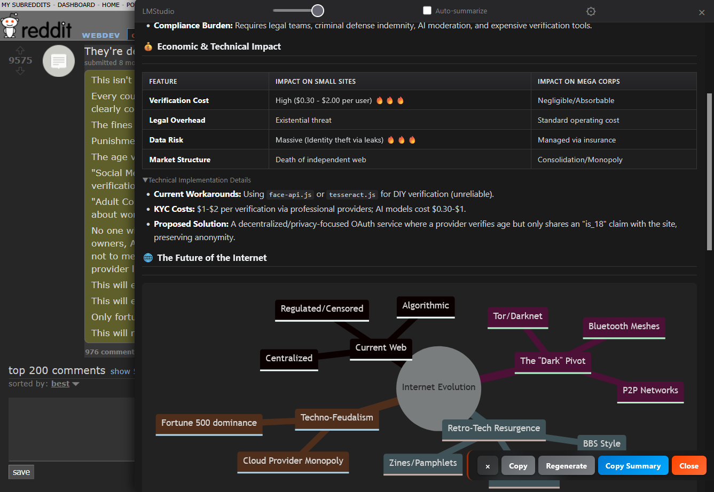

# user-scripts

A collection of userscripts for [Violentmonkey](https://violentmonkey.github.io/) / [Tampermonkey](https://www.tampermonkey.net/).

## Scripts

### [AI Page Summarizer](ai-summarizer/)

Reads the page so you don't have to. One click sends it to a local LLM and streams back bullet points, mermaid diagrams, sentiment bars, tables. Works on Reddit, HN, Stack Overflow, Discourse, blogs, docs, anything.

- Streaming markdown with live rendering
- Mermaid diagrams: mindmaps, flowcharts, sequence, pie, timeline
- Visual element picker for custom site configs
- Auto-summarize per domain
- Works as userscript or browser extension (Chrome/Firefox)

[Full documentation](ai-summarizer/README.md)

---

### [Outlook Junk Auto-Delete](outlook-junk-autodelete/)

Auto-deletes junk emails from known spam senders in Outlook Web. Polls the Junk folder via OWA's internal API, matches against a configurable blocklist, soft-deletes matches. Zero setup beyond editing the sender list.

[Full documentation](outlook-junk-autodelete/README.md)

---

### [Outlook Unread Count](outlook-unread-count/)

Adds a total unread count to the Outlook Web tab title, e.g. `(5) Mail`.

[Full documentation](outlook-unread-count/README.md)

## Install

1. Install [Violentmonkey](https://violentmonkey.github.io/) (recommended) or Tampermonkey
2. Click any `.user.js` file in this repo, the extension will prompt to install
3. Or open the raw file URL directly

## License

[MIT](LICENSE)
